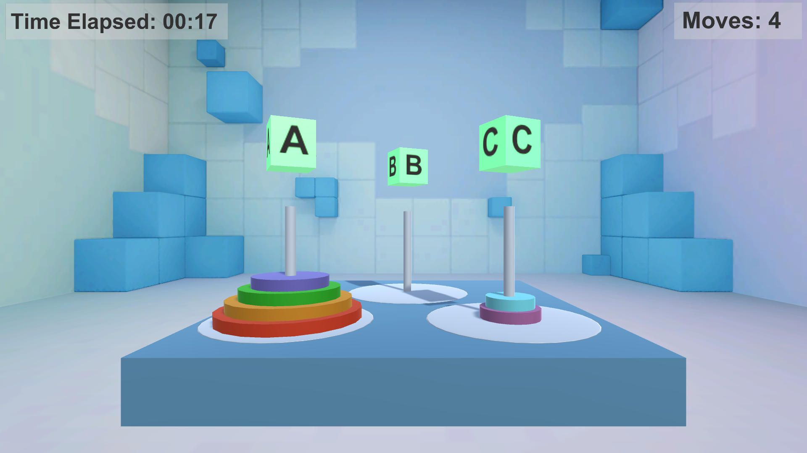

# Tower of Hanoi

The Tower of Hanoi, is a mathematical problem which consists of three rods and multiple disks. Initially, all the disks are placed on one rod, one over the other in ascending order of size similar to a cone-shaped tower.

The objective of this problem is to move the stack of disks from the initial rod to another rod, following these rules:

* Move only one disc at a time.
* A disk cannot be placed on top of a smaller disk
* No disk can be placed on top of the smaller disk.

Checkout the [video](https://youtu.be/fukfXXH-EKY) for demo.

## Screenshots

 

 

## Tools used

* [Unity](https://unity.com/) - Game Engine used to design and develop the game.

## Instructions and Controls

* Use "WASD" keys for player movement.
* Hold right mouse click button to look around.
* Use left mouse click to select any particular disc.
* Click on any of the rotating cubes above towers to transfer the selected disc to the intent tower.
* Press "Esc" key to open pause menu.

 

## Building and Running

    Note: This project has been compiled and tested using Unity 2019.2.12f1
    
 Feel free use the already built application inside the "Build" folder or use it to modify and build as per your requirements.

 Instructions to build -
 
 1. Open the SampleScene inside the scenes folder.
 2. Select ExampleStreaming gameobject in the heirarchy window.
 3. To build, File -> Build Settings(Ctrl + Shift + B), click "Add Open Scenes" and check "Scenes/SampleScene".
 5. Click "Build and Run" (Ctrl + B).
 6. Follow the rules, instructions, and Controls.
 7. Enjoy!

## Contributing

You are welcome to contribute -

1. Fork it!
2. Create your feature branch: `git checkout -b my-new-feature`
3. Commit your changes: `git commit -am 'Add some feature'`
4. Push to the branch: `git push origin my-new-feature`
5. Submit a pull request :D